# Automated SOC Pipeline Using Wazuh, Shuffle, and TheHive

*A SOC-focused security lab demonstrating automated threat detection, intelligence enrichment, and incident response orchestration.*

by: Brandon Chaney

## Overview

Modern Security Operations Centers (SOCs) rely on both detection and automation to rapidly identify and respond to security threats. This project demonstrates the design and implementation of an end-to-end detection and response pipeline that combines endpoint telemetry, custom threat detection, automated enrichment, and incident management.

> Using Sysmon, Wazuh, Shuffle, VirusTotal, and TheHive, in this lab, I've simulated a Mimikatz attack that generates endpoint telemetry which is collected and analyzed against a custom detection rule, enriched with external threat intelligence, converted into an investigation case, and automatically delivered to a security analyst for review.

## Objectives
- [x] Build an end-to-end SOC detection and response pipeline.
- [x] Collect endpoint telemetry using Sysmon and Wazuh.
- [x] Detect Mimikatz activity with a custom Wazuh rule.
- [x] Automate alert enrichment using VirusTotal.
- [x] Create investigation cases in TheHive.
- [x] Notify analysts through an automated Shuffle workflow.

## Environment Architecture

### Lab Components

| Component | Concept | Description |
|-----------|---------|-------------|
| Windows Endpoint |  | Simulated credential dumping with Mimikatz. |
| Sysmon |  | Captured detailed endpoint telemetry. |
| Wazuh Agent |  | Forwarded Sysmon logs to the Wazuh Manager. |
| Wazuh Manager |  | Processed logs and generated alerts. |
| Shuffle |  | Automated enrichment and response workflows. |
| VirusTotal |  | Enriched alerts with threat intelligence. |
| TheHive |  | Created cases for analyst investigations. |
| Email Service |  | Sent automated analyst notifications. |
### Data Flow
1. Collect Endpoint Telemetry – Sysmon captures Windows endpoint activity and the Wazuh Agent securely forwards the telemetry to the Wazuh Manager.
2. Detect Malicious Activity – Wazuh analyzes incoming events against custom detection rules and generates a security alert upon identifying suspicious activity.
3. Enrich Security Alert – Shuffle automates the workflow by enriching the alert with VirusTotal intelligence and creating an investigation case in TheHive.
4. Notify Security Analyst – An automated email delivers the enriched alert to the analyst, enabling immediate investigation and response.

  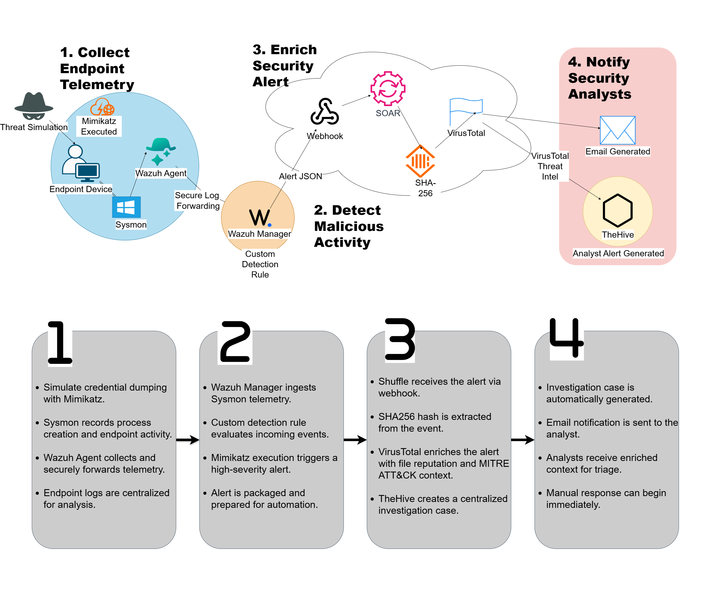
   
  <em>Security Data Flow: Detection and Incident Automation</em>

## Methodology

### Environment Setup

I started this lab by downloading Sysmon & its Olaf configuration onto a Windows VM. I will have 3 total machines running in my local network: 1. The Windows VM that will be configured with a Wazuh Agent that transfers Sysmon logs to the Wazuh Manager, 2. The Wazuh Manager Instance running in a Linux VM, and 3. An instance of TheHive running also on a Linux VM.

I proceeded by downloading a Debian Linux server, installing the Wazuh Manager. I downloaded an additional Debian Linux server, and installed TheHive and its dependencies. I configured Cassandra and Elasticsearch to communicate locally, and, after enabling port 9000 on the TheHive VM, the service web application is reachable.

  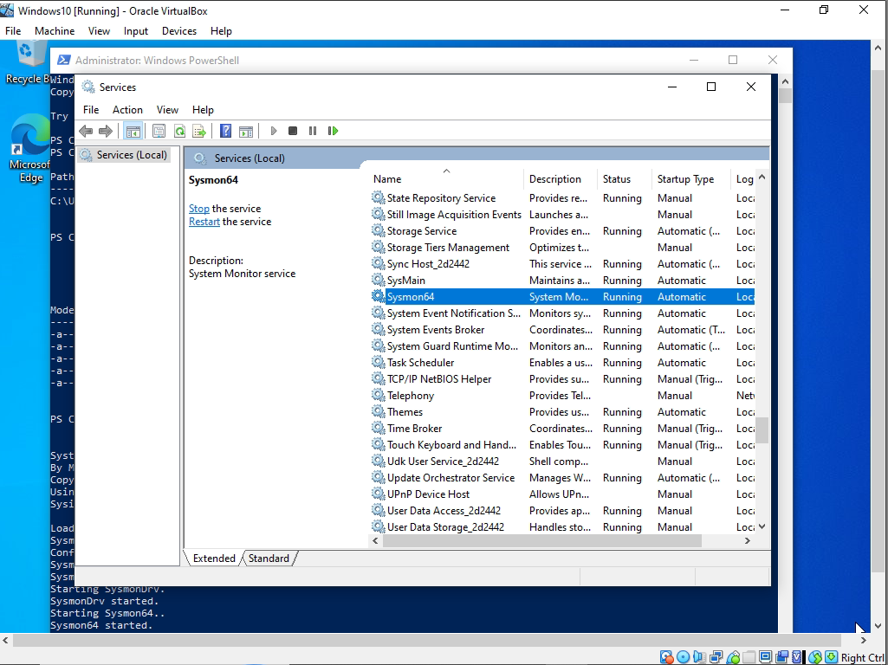
   
  <em>jist of picture</em>

  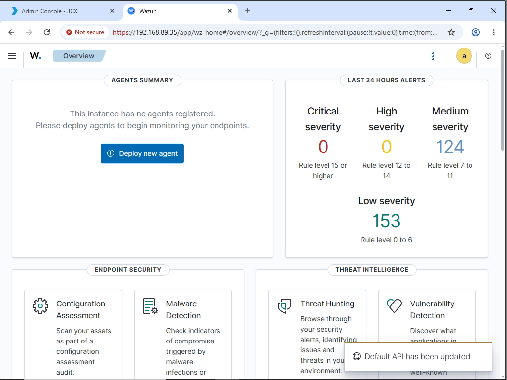
   
  <em>jist of picture</em>

  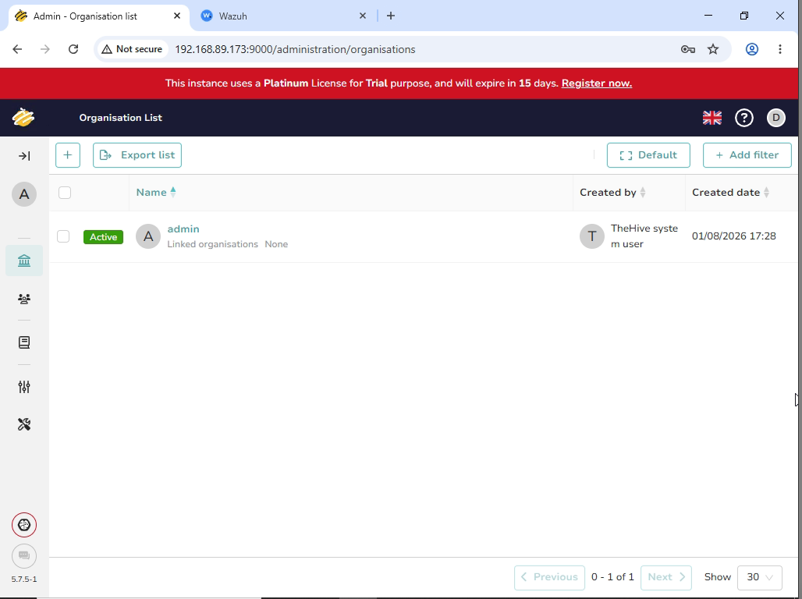
   
  <em>jist of picture</em>

### Telemetry Collection

Now, I've configured Sysmon telemetry to be collected by the Agent and forwarded to the Wazuh Manager, and created a custom detection rule looking for Mimikatz activity. I've added Sysmon logs to the Windows Wazuh Agent, and Sysmon logs are now ingested into our SIEM!

We will be using Mimikatz, so the firewall will need to be disabled. I continue preparation of the the telemetry phase by deploying the Wazuh Agent onto the Sysmon machine, and the .SVC has started successfully! I Opened ports 1514/1515 for the Wazuh Manager VM to communicate with the Agent and restarted service. Upon checking the web application, our Agent is registered in Wazuh.

  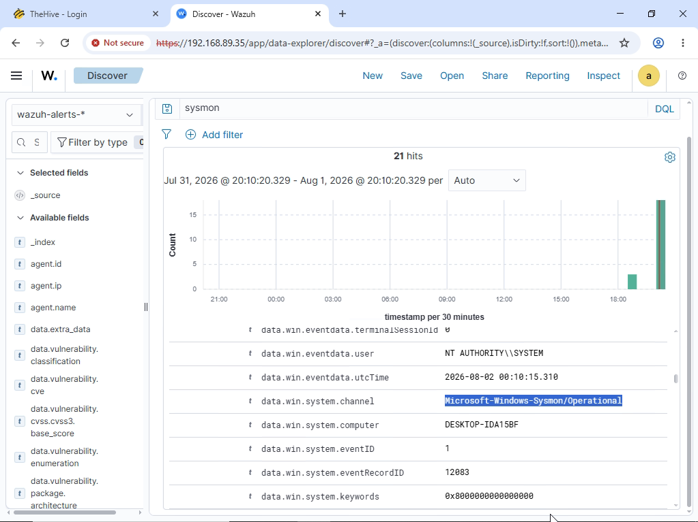
   
  <em>jist of picture</em>

  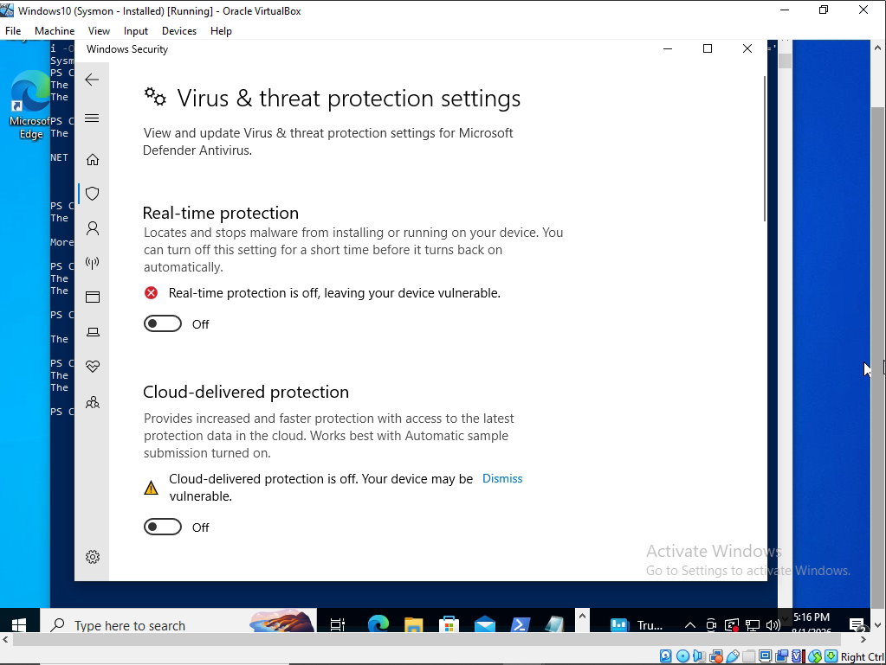
   
  <em>jist of picture</em>

  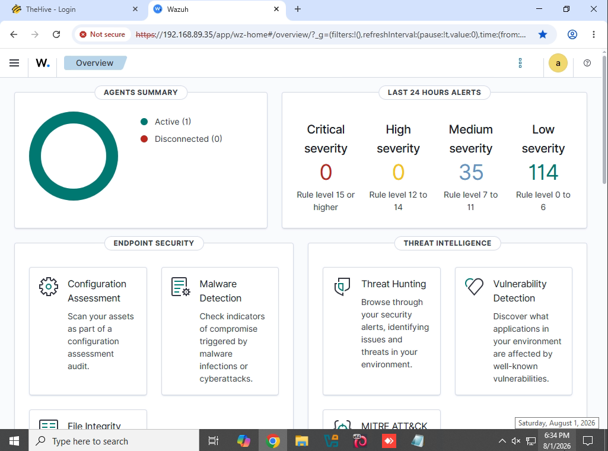
   
  <em>jist of picture</em>

### Detection Engineering

Now that the endpoint telemetry has been established, I will move onto the detection section. On our Wazuh Agent, we can now run Mimikatz. Wazuh does not currently detect our malicious activity on our endpoint, and we must now make our own custom rules to adjust our security posture. I altered the configuration file to capture all logs now. After that, I will create a new index pattern aggregated by the time field “timestamp”. The logs for Mimikatz are now being captured under the new index.

  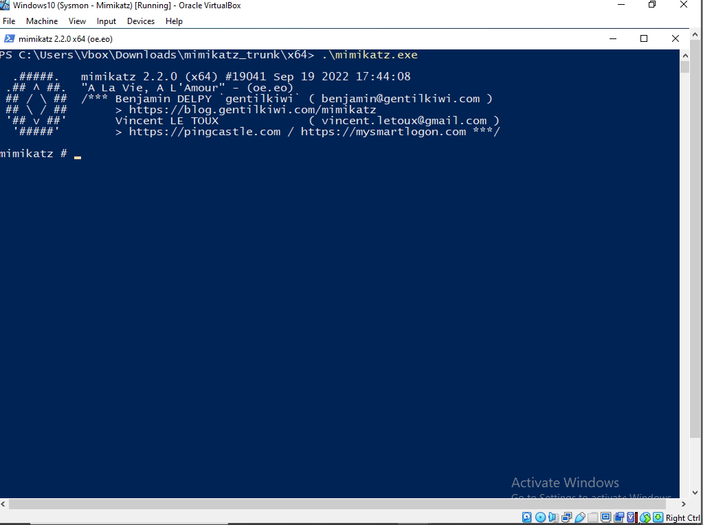
   
  <em>jist of picture</em>

  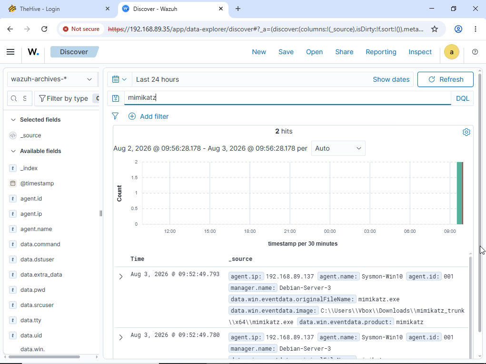
   
  <em>jist of picture</em>

I created a simple rule to detect Mimikatz usage. This rule effectively detects standard Mimikatz usage in a lab environment by identifying the executable name through Sysmon. But, in a SOC environment, stronger detections would rely on behavioral indicators since filenames can be changed to bypass detection. And now the rule has triggered the generation of an alert.

  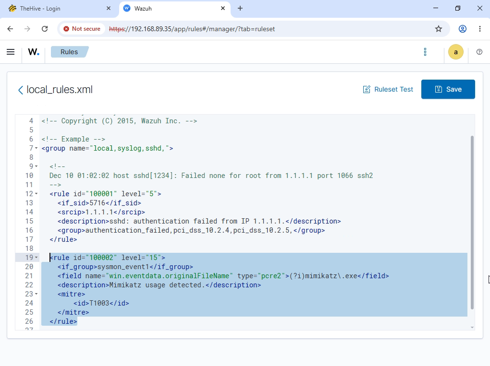
   
  <em>jist of picture</em>

  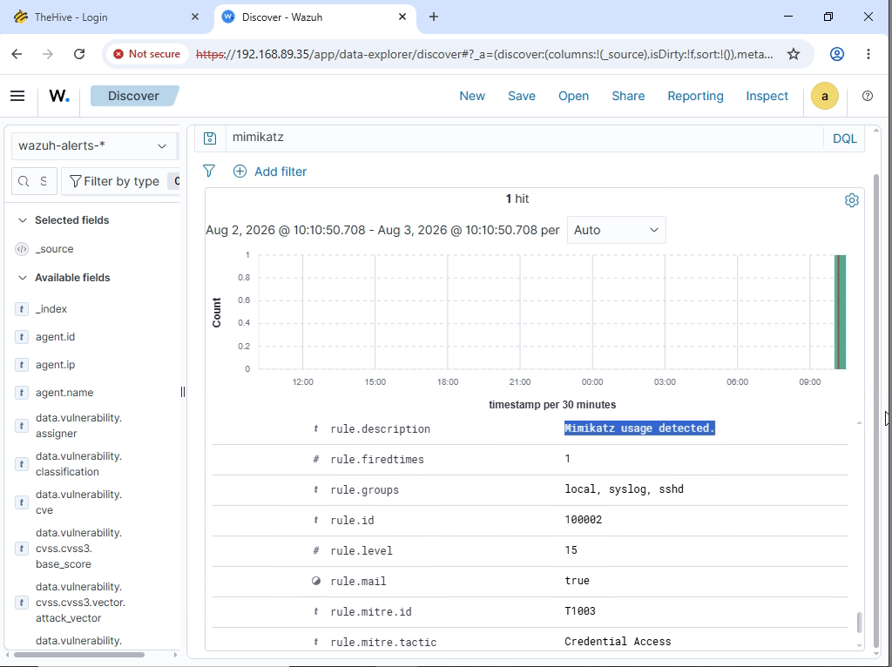
   
  <em>jist of picture</em>

### SOAR Automation

The next step will be to tie everything in with an automated workflow. I am using Shuffler.io to create a new workflow for this. I’ve pointed Wazuh toward my Shuffler integration using the hook URI, and the workflow is able to receive the alert.

Here is the workflow: The webhook will use its URI to receive alerts generated from Sysmon via our Wazuh Agent, sent to our Wazuh Manager and finally to our Shuffler webhook. Next, the hash is taken, and regex is performed to pull that SHA256, which is sent to the VirusTotal API, and given a hash assessment. The information is passed to TheHive and an alert is created!

I realized I made all of my machines communicate locally and Shuffle cannot trace my Hive IP, so I made a temporary tunnel via CloudFlair. Okay, now the alert is generated in TheHive! Finally, we will send an email to our analyst to inspect the alert.

Here is the final workflow, and email sent.

  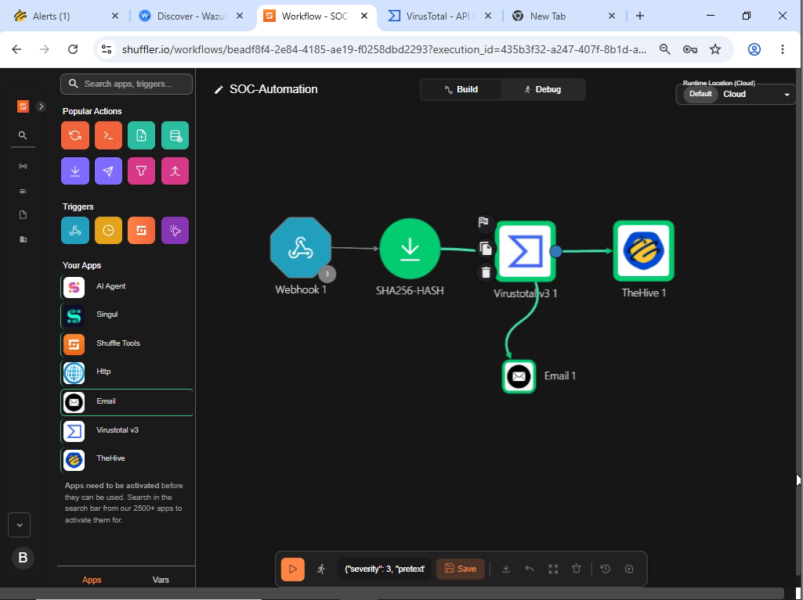
   
  <em>jist of picture</em>

### Validation & Results

  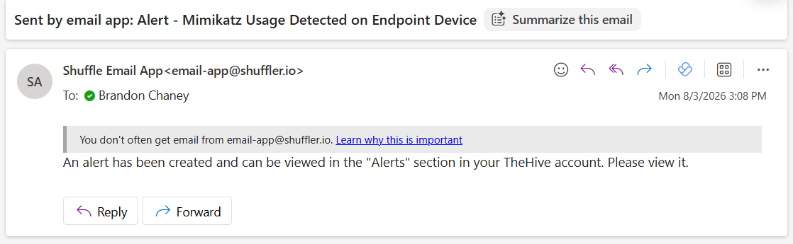
   
  <em>jist of picture</em>

  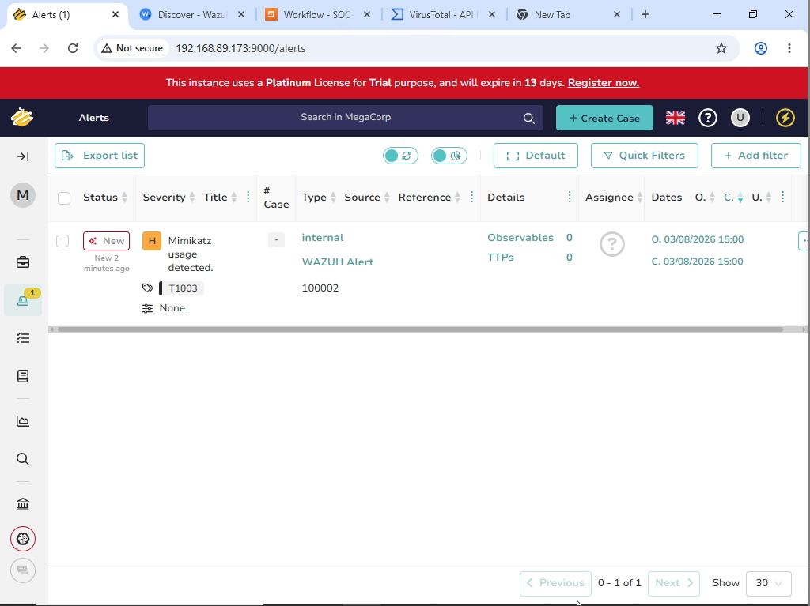
   
  <em>jist of picture</em>

### Performance Metrics

>The automated enrichment and alerting workflow completed in approximately 3.1 seconds, including SHA256 extraction, VirusTotal enrichment, TheHive alert creation, and analyst email notification. 

While this timing reflects a controlled lab environment, it demonstrates how security automation reduces the time between detection and analyst awareness. By automatically enriching alerts, creating investigation cases, and sending notifications, the workflow provides analysts with actionable context almost immediately, enabling faster triage and supporting a lower Mean Time to Respond (MTTR).

| Event | Timestamp | Elapsed |
|-------|-----------|---------|
| Workflow started | 19:08:01.223 | 0.000 s |
| SHA256 extracted | 19:08:01.690 | 0.467 s |
| VirusTotal response received | 19:08:02.632 | 1.409 s |
| TheHive response received | 19:08:03.788 | 2.565 s |
| Email response received | 19:08:04.128 | 2.905 s |
| Workflow finished | 19:08:04.285 | 3.062 s |

## Key Findings

- Endpoint telemetry can be centralized and monitored in near real time using Wazuh.
- Custom detection rules enable identification of attack techniques beyond default detections.
- SOAR automation significantly reduces manual incident response tasks through enrichment and case creation.
- Threat intelligence integration improves alert context and investigation efficiency.
- The end-to-end detection and response workflow completed in approximately **3.1 seconds**.

## Skills Demonstrated

- Wazuh SIEM administration
- Sysmon endpoint monitoring
- Custom detection engineering
- SOAR workflow automation
- API and webhook integration
- Threat intelligence enrichment (VirusTotal)
- TheHive case management
- Security event analysis
- MITRE ATT&CK mapping

## Future Improvements

- Develop behavioral detections for credential dumping.
- Correlate multiple events to improve detection accuracy.
- Automate endpoint containment actions.
- Expand coverage to additional attack techniques.
- Perform false-positive tuning and performance validation.
